----

<p align="center">
  
</p>

<h2 align="center">Universidad Peruana de Ciencias Aplicadas</h2>

---

<p align="center">
  Carrera: de Ingeniería de Software<br>
  Ciclo: 2025-01<br><br>

# Curso: Desarrollo de Aplicaciones Open Source<br>
 ### Sección: 4328<br><br>

  ### Informe del TB1<br>
  ### Startup: Oasis<br>
  ### Producto: Oasis App<br><br>

  ### Integrantes:<br>
  - Juan Miguel Quijano - u202221068 Calderon<br>
  - Carlos Humberrto Zarate Peñao - U202315966 <br>
  - Daniel Elias Ruiz Huisa -202210764 <br>
 - Jhon Rony Huamani Aguilar - u20211d859<br>
 - Poly Gabriel Alcantara Baldeon- U202418250 <br><br>

  <strong> Abril del 2025 </strong>
</p>

---
**Tabla de Contenidos**
- [Curso: Desarrollo de Aplicaciones Open Source](#curso-desarrollo-de-aplicaciones-open-source)
    - [Sección: 4328](#sección-4328)
    - [Informe del TB1](#informe-del-tb1)
    - [Startup: Oasis](#startup-oasis)
    - [Producto: Oasis App](#producto-oasis-app)
    - [Integrantes:](#integrantes)
  - [Capítulo I](#capítulo-i)
    - [1.1. Startup Profile](#11-startup-profile)
      - [1.1.1. Descripción de la Startup](#111-descripción-de-la-startup)
      - [1.1.2. Perfiles de integrantes del equipo](#112-perfiles-de-integrantes-del-equipo)
    - [1.2. Solution Profile](#12-solution-profile)
      - [1.2.1. Antecedentes y problemática](#121-antecedentes-y-problemática)
      - [1.2.2. Lean UX Process](#122-lean-ux-process)
        - [1.2.2.1. Lean UX Problem Statements](#1221-lean-ux-problem-statements)
        - [1.2.2.2. Lean UX Assumptions](#1222-lean-ux-assumptions)
        - [1.2.2.3. Lean UX Hypothesis Statements](#1223-lean-ux-hypothesis-statements)
        - [1.2.2.4. Lean UX Canvas](#1224-lean-ux-canvas)
    - [1.3. Segmentos objetivo](#13-segmentos-objetivo)
  - [Capítulo II: Requirements Elicitation \& Analysis](#capítulo-ii-requirements-elicitation--analysis)
    - [2.1. Competidores](#21-competidores)
      - [2.1.1. Análisis competitivo](#211-análisis-competitivo)
  - [**Competitive Analysis Landscape**](#competitive-analysis-landscape)
  - [| **Debilidades** | No permite reserva directa, alcance limitado. | Puede resultar impersonal, stock masivo puede dificultar elección. | Enfocado a alto presupuesto, sin opción de reserva directa. | Limitado a países angloparlantes, especialmente EE.UU. |](#-debilidades--no-permite-reserva-directa-alcance-limitado--puede-resultar-impersonal-stock-masivo-puede-dificultar-elección--enfocado-a-alto-presupuesto-sin-opción-de-reserva-directa--limitado-a-países-angloparlantes-especialmente-eeuu-)
      - [2.1.2. Estrategias y tácticas frente a competidores](#212-estrategias-y-tácticas-frente-a-competidores)
  - [**Estrategias de Oasis:**](#estrategias-de-oasis)
    - [2.2. Entrevistas](#22-entrevistas)
      - [2.2.1. Diseño de entrevistas](#221-diseño-de-entrevistas)
      - [2.2.2. Registro de entrevistas](#222-registro-de-entrevistas)
      - [2.2.3. Análisis de entrevistas](#223-análisis-de-entrevistas)
    - [2.3. Needfinding](#23-needfinding)
      - [2.3.1. User Personas](#231-user-personas)
  - [](#)
      - [2.3.2. User Task Matrix](#232-user-task-matrix)
      - [2.3.3. User Journey Mapping](#233-user-journey-mapping)
      - [2.3.4. Empathy Mapping](#234-empathy-mapping)
      - [2.3.5. As-is Scenario Mapping](#235-as-is-scenario-mapping)
  - [Capítulo III: Requirements Elicitation Specification](#capítulo-iii-requirements-elicitation-specification)
      - [3.1. To-Be Scenario Mapping](#31-to-be-scenario-mapping)
      - [3.2. User Stories.](#32-user-stories)
      - [3.3. Impact Mapping.](#33-impact-mapping)
  - [Ubiquitous Language](#ubiquitous-language)
- [Capítulo IV: Product Design](#capítulo-iv-product-design)
  - [4.1. Style Guidelines](#41-style-guidelines)
    - [4.1.1. General Style Guidelines](#411-general-style-guidelines)
    - [4.1.2. Web Style Guidelines](#412-web-style-guidelines)
    - [4.1.3. Mobile Style Guidelines](#413-mobile-style-guidelines)
  - [4.2. Information Architecture](#42-information-architecture)
    - [4.2.1. Organization Systems](#421-organization-systems)
    - [4.2.2. Labeling Systems](#422-labeling-systems)
    - [4.2.3. SEO Tags and Meta Tags](#423-seo-tags-and-meta-tags)
    - [4.2.4. Searching Systems](#424-searching-systems)
    - [4.2.5. Navigation Systems](#425-navigation-systems)
  - [4.3. Landing Page UI Design](#43-landing-page-ui-design)
    - [4.3.1. Landing Page Wireframe](#431-landing-page-wireframe)
    - [4.3.2. Landing Page Mock-up](#432-landing-page-mock-up)
    - [4.6 Domain-Driven Software Architecture](#46-domain-driven-software-architecture)
    - [4.6.1 Software Architecture Context Diagram](#461-software-architecture-context-diagram)
    - [4.6.2  Software Architecture Container Diagrams](#462--software-architecture-container-diagrams)
    - [4.6.3. Software Architecture Components Diagrams](#463-software-architecture-components-diagrams)
  - [4.7. Software Object-Oriented Design](#47-software-object-oriented-design)
    - [4.7.2 Class dictionary](#472-class-dictionary)
  - [Class Dictionary - Proyecto Oasis](#class-dictionary---proyecto-oasis)
    - [OAS\_Usuarios](#oas_usuarios)
    - [OAS\_Lugares](#oas_lugares)
    - [OAS\_Accesibilidad](#oas_accesibilidad)
    - [OAS\_Lugar\_Accesibilidad](#oas_lugar_accesibilidad)
    - [OAS\_Reservas](#oas_reservas)
    - [OAS\_Experiencias](#oas_experiencias)
  - [4.8 Database Desing](#48-database-desing)
    - [4.8.1 Database Diagram](#481-database-diagram)
  - [Capítulo V: Product Implementation, Validation \& Deployment](#capítulo-v-product-implementation-validation--deployment)
    - [5.1. Software Configuration Management.](#51-software-configuration-management)
      - [5.1.1. Software Development Environment Configuration.](#511-software-development-environment-configuration)
      - [5.1.2. Source Code Management.](#512-source-code-management)
      - [5.1.3. Source Code Style Guide \& Conventions.](#513-source-code-style-guide--conventions)
      - [5.1.4. Software Deployment Configuration.](#514-software-deployment-configuration)
    - [5.2. Landing Page, Services \& Applications Implementation.](#52-landing-page-services--applications-implementation)
      - [5.2.1. Sprint 1.](#521-sprint-1)
      - [5.2.1.1. Sprint Planning 1.](#5211-sprint-planning-1)
      - [5.2.1.2. Aspect Leaders and Collaborators.](#5212-aspect-leaders-and-collaborators)
      - [5.2.1.3. Sprint Backlog 1](#5213-sprint-backlog-1)
      - [5.2.1.4. Development Evidence for Sprint Review.](#5214-development-evidence-for-sprint-review)
      - [5.2.1.5. Execution Evidence for Sprint Review.](#5215-execution-evidence-for-sprint-review)
      - [5.2.1.6. Services Documentation Evidence for Sprint Review.](#5216-services-documentation-evidence-for-sprint-review)
  - [User Stories relacionadas a Servicios](#user-stories-relacionadas-a-servicios)
      - [5.2.1.7. Software Deployment Evidence for Sprint Review.](#5217-software-deployment-evidence-for-sprint-review)
      - [5.2.1.8. Team Collaboration Insights during Sprint.](#5218-team-collaboration-insights-during-sprint)

---

## Capítulo I

### 1.1. Startup Profile

#### 1.1.1. Descripción de la Startup

**Ecosphere** es una plataforma digital que aborda el desafío de la inaccesibilidad del turismo de lujo estilo glamping para gran parte de la población. En un contexto donde el turismo se está reactivando como motor económico en el Perú luego del impacto de la pandemia, nuestra solución busca democratizar esta forma de viaje, ofreciendo una experiencia personalizada, asequible y descentralizada.

Nos comprometemos a ofrecer una alternativa sostenible, inclusiva e innovadora para personas de todos los niveles socioeconómicos. Desde jóvenes viajeros y familias hasta profesionales que buscan desconexión en la naturaleza, nuestro servicio brinda la oportunidad de disfrutar de escapadas únicas en contacto con el entorno natural sin renunciar al confort.

Trabajamos con emprendedores turísticos locales, comunidades rurales y operadores de glamping para fomentar el turismo responsable, la valorización del territorio y la dinamización de economías regionales.

En Ecosphere, creemos en el poder de la tecnología y la comunidad para generar un impacto positivo en el sector turístico.

**Misión**  
Brindar experiencias de glamping personalizadas y accesibles en todo el Perú, integrando tecnología, sostenibilidad y colaboración con actores locales para transformar el turismo en una práctica inclusiva y descentralizada.

**Visión**  
Convertirnos en la plataforma líder de turismo de naturaleza de lujo accesible en Latinoamérica, promoviendo un nuevo estándar de viaje que equilibre comodidad, respeto ambiental y desarrollo local.

#### 1.1.2. Perfiles de integrantes del equipo

**Información**

| Foto | Nombre | Código | Descripción |
|------|--------|--------|-------------|
|  | Nombre: | Código: | Descripción: |
|  | Carlos Humberrto Zarate Peña | U202315966 | Soy un estudiante de Ingeniería de Software curioso y constante, disfruto resolver problemas, trabajar en equipo y aprender siempre algo nuevo sobre tecnología. |
|  | Daniel Elias Ruiz Huisa | 202210764 | Soy un estudiante entusiaste que busca sacar el maximo provecho al aprendizaje. Adoro los videojuegos, la matematica oculta detras de los algoritmos y la musica. |
|  |Juan Miguel Quijano Calderón | u20221068|Mi nombre es Juan Quijano, tengo 20 años y soy un estudiante de la carrera de Ingeniería de Software. Tengo conocimientos intermedios en programación y quisiera dedicarme eventualmente al desarrollo y uso de IA. |
|  | Poly Gabriel Alcantara Baldeon | U202418250 | Soy estudiante de Ingenieria de Software. Tengo conocimientos basicos en c#, Java y Python. Me gustaria aprender mas sobre desarrollo de videojuegos |
|  | Jhon Rony Huamani Aguilar | u20211d859 | Soy estudiante de Ingenieria de Software. Tengo conocimientos intermedios de programación.|

---

### 1.2. Solution Profile

#### 1.2.1. Antecedentes y problemática

En los últimos años, el Perú ha experimentado un resurgimiento del sector turístico, impulsado por el deseo de reconexión con la naturaleza y la búsqueda de experiencias únicas post-pandemia. Sin embargo, la oferta de turismo de lujo como el glamping sigue siendo limitada, costosa y centralizada en pocos lugares turísticos de renombre.

Sin una solución efectiva para democratizar esta experiencia, el problema ha contribuido a la concentración económica en ciertos destinos y a la exclusión de sectores con menor poder adquisitivo. Parte de la oferta actual es desarrollada por actores privados que no consideran una expansión territorial equitativa, lo que agrava las brechas sociales y limita el impacto económico positivo en comunidades rurales.

**Problemática (6W + 1H)**

- **What (Qué):** Falta de acceso descentralizado, personalizado y asequible al turismo de lujo tipo glamping en el Perú.
- **When (Cuándo):** Especialmente evidente después del resurgimiento del turismo post-pandemia.
- **Where (Dónde):** En regiones con potencial turístico aún no desarrollado: sierra, selva, y zonas costeras alternativas del Perú.
- **Who (Quiénes):** Afecta a turistas nacionales y extranjeros con presupuesto medio, y a comunidades rurales con potencial turístico.
- **Why (Por qué):** Porque las propuestas actuales están centralizadas, son gestionadas por pocos operadores y mantienen precios elevados.
- **How (Cómo):** Limita la inclusión de nuevos públicos en el turismo de lujo y frena el desarrollo de regiones fuera del circuito tradicional.
- **How much (Cuánto):** Se estima que un 70% del turismo de lujo se concentra en menos del 15% del territorio nacional, generando oportunidades perdidas en regiones rurales con alto valor ecológico y cultural.

#### 1.2.2. Lean UX Process

##### 1.2.2.1. Lean UX Problem Statements

**Problema Principal:** Existe una brecha significativa entre la creciente demanda de experiencias de viaje auténticas y conectadas con la naturaleza, como el glamping, y la oferta actual en Perú. Esta última se caracteriza frecuentemente por su concentración en pocas zonas geográficas, precios que resultan elevados para un amplio segmento de la población y opciones de personalización de la experiencia que son limitadas o inexistentes.

**Impactos del Problema:**
* Viajeros con presupuestos moderados o aquellos que buscan opciones más flexibles y adaptadas a sus intereses particulares, ven restringidas sus posibilidades de acceder a este tipo de turismo experiencial.
* Comunidades rurales y emprendedores locales con potencial para desarrollar ofertas de glamping únicas, auténticas y sostenibles enfrentan barreras significativas para ingresar al mercado, limitando su capacidad de generar ingresos y beneficiarse del desarrollo turístico.
* La diversidad de experiencias de glamping disponibles para el público general es reducida, lo que resulta en un desaprovechamiento de la vasta riqueza natural y cultural que poseen múltiples regiones del Perú, más allá de los circuitos turísticos tradicionales.

**Pregunta Clave de Enfoque (Centrada en el Problema):**
*¿Cómo podríamos abordar las barreras de acceso económico y geográfico, así como la limitada diversidad y personalización en la oferta de experiencias de glamping en Perú, con el fin de satisfacer las necesidades y expectativas de un espectro más amplio de viajeros y, simultáneamente, fomentar la creación de nuevas oportunidades de desarrollo para las comunidades locales y emprendedores regionales?*

##### 1.2.2.2. Lean UX Assumptions

**Suposiciones del Negocio (Business Assumptions):**

-   Las personas están dispuestas a invertir en experiencias de glamping si estas ofrecen una clara propuesta de valor en términos de personalización, autenticidad y precios competitivos.
-   Existen comunidades y emprendedores rurales con terrenos y recursos adecuados que están interesados y motivados en desarrollar y ofrecer servicios de glamping de calidad si se les facilitan las herramientas y el acceso al mercado.
-   Un modelo de negocio que conecte directamente a viajeros con anfitriones locales puede optimizar costos operativos y aumentar la visibilidad de experiencias únicas y descentralizadas.
-   Existe un segmento de mercado creciente y desatendido que busca activamente alternativas a los hoteles tradicionales y valora la sostenibilidad, la conexión con la naturaleza y el impacto positivo en las comunidades locales.
-   La inversión estratégica en marketing digital y la promoción focalizada en destinos no tradicionales pueden generar un interés significativo y una demanda constante si se comunican de manera efectiva los atractivos y singularidades de cada lugar.
-   Los anfitriones rurales poseen un conocimiento local invaluable (cultural, gastronómico, natural) que, si se integra y canaliza adecuadamente, puede enriquecer sustancialmente la experiencia del viajero y diferenciar la oferta.
-   Un modelo de comisiones por reserva confirmada y concretada es un esquema de monetización viable, transparente y escalable, aceptable tanto para los anfitriones como para la plataforma.
-   La creación de alianzas estratégicas con entidades de promoción turística regional, ONGs de desarrollo local y cooperativas puede acelerar la adopción de la plataforma y la expansión de la oferta de glamping.

**Resultados Esperados del Negocio (Business Outcomes):**

-   Incremento progresivo del número de reservas mensuales a través de la plataforma, alcanzando un crecimiento promedio del 25% durante el primer año de operaciones.
-   Incorporación de al menos 20 nuevas y diversas ubicaciones de glamping, con un énfasis en regiones emergentes y con limitado desarrollo turístico previo, dentro de los primeros 18 meses.
-   Lograr un índice de satisfacción del anfitrión (Host Satisfaction Score) igual o superior a 4.5 sobre 5 estrellas, medido a través de encuestas trimestrales y feedback directo.
-   Generar un volumen de transacciones que permita cubrir los costos operativos totales y alcanzar el punto de equilibrio financiero en un plazo máximo de 24 meses desde el lanzamiento.
-   Posicionar la marca Oasis como un referente reconocido en el mercado peruano por ofrecer turismo de glamping accesible, auténtico y sostenible.
-   Reducción del costo de adquisición de clientes (CAC) en un 15% tras el primer año de operación, impulsado por el crecimiento orgánico, las recomendaciones de usuarios satisfechos y el marketing de boca a boca.
-   Alcanzar una tasa de ocupación promedio del 50% para los anfitriones activos y validados en la plataforma después de los primeros 9 meses de su incorporación.

**Suposiciones del Usuario (User Assumptions):**

-   Los viajeros confían de manera creciente en las recomendaciones, reseñas detalladas y calificaciones proporcionadas por otros usuarios al momento de planificar y tomar decisiones sobre sus viajes.
-   Los usuarios esperan y valoran la capacidad de realizar todo el proceso de búsqueda, comparación, personalización y reserva de manera completamente online, con una experiencia fluida y optimizada para dispositivos móviles.
-   La seguridad en las transacciones financieras y la protección rigurosa de sus datos personales son factores críticos e innegociables para generar y mantener la confianza del usuario en la plataforma.
-   Los viajeros, especialmente en un contexto de planificación flexible, valoran positivamente la existencia de políticas de cancelación claras, justas y adaptables.
-   Los usuarios consideran que la calidad y veracidad de la información visual (fotografías, videos) de los alojamientos y su entorno son determinantes para su elección.
-   Los viajeros están dispuestos a pagar un precio justo por experiencias que perciben como auténticas, personalizadas y que contribuyen al desarrollo local.

**Beneficios para el Usuario (User Benefits):**

-   Mayor acceso a una oferta diversa y curada de experiencias de glamping, con opciones que se ajustan a diferentes presupuestos y preferencias, a lo largo de todo el territorio peruano.
-   Posibilidad de personalizar su estadía de manera significativa, eligiendo no solo el tipo de alojamiento, sino también actividades complementarias, servicios adicionales y el nivel de interacción cultural deseado.
-   Descubrimiento de "joyas ocultas" y destinos auténticos y menos convencionales, fomentando un turismo más distribuido, consciente y enriquecedor.
-   Confianza y seguridad durante todo el proceso de reserva y pago, respaldado por políticas transparentes, un sistema de pago robusto y un canal de soporte al cliente eficiente.
-   Ahorro significativo de tiempo y esfuerzo en la planificación de viajes de glamping, al centralizar la búsqueda, comparación, personalización y reserva en una única plataforma intuitiva.
-   Oportunidad de apoyar directamente a emprendedores locales y comunidades rurales, contribuyendo a un modelo de turismo más sostenible y equitativo.
-   Acceso a información detallada y verificada sobre cada destino y anfitrión, incluyendo reseñas de otros viajeros, para tomar decisiones informadas.

##### 1.2.2.3. Lean UX Hypothesis Statements

-   **Hipótesis 1 (Personalización Avanzada):** Creemos que *al ofrecer a los usuarios la capacidad de filtrar y seleccionar múltiples atributos de su experiencia de glamping (ej. tipo de entorno natural, nivel de aventura deseado, servicios específicos como Wi-Fi de alta velocidad, pet-friendly, opciones gastronómicas locales)*, lograremos *un aumento en la tasa de conversión de "búsqueda detallada" a "inicio de proceso de reserva" en un 15% para aquellos usuarios que utilicen al menos tres filtros de personalización avanzada*, porque *los usuarios valoran profundamente tener un control granular sobre su experiencia y encontrar opciones que se alineen precisamente con sus necesidades, deseos y estilo de viaje*. Sabremos que esto es cierto si, tras implementar un sistema de filtros avanzados y personalización detallada, observamos el incremento mencionado en la tasa de conversión en un plazo de 3 meses, medido a través de las analíticas de la plataforma.
-   **Hipótesis 2 (Impacto de la Oferta Descentralizada):** Creemos que *al destacar y promocionar activamente experiencias de glamping ubicadas en regiones menos conocidas pero con un alto potencial turístico y cultural, utilizando narrativas visuales y testimoniales atractivas*, lograremos que *al menos el 30% del total de las reservas confirmadas a través de la plataforma durante el primer año de operación correspondan a estos destinos emergentes*, porque *existe un segmento creciente de viajeros (exploradores conscientes) que busca activamente salir de las rutas turísticas convencionales y descubrir lugares auténticos, menos masificados y con una fuerte conexión local*. Validaremos esta hipótesis si alcanzamos o superamos dicha proporción de reservas en destinos emergentes en el tiempo estipulado, analizando los datos de geolocalización de las reservas.
-   **Hipótesis 3 (Optimización de la Experiencia de Reserva):** Creemos que *al diseñar un flujo de reserva extremadamente simplificado, intuitivo y visualmente guiado, que no exceda los 4 pasos clave (selección y personalización, datos del huésped, revisión y pago, confirmación) y que sea completamente responsive en la plataforma web y móvil*, conseguiremos que *el 90% de los usuarios que inicien el proceso de reserva lo completen exitosamente sin necesidad de asistencia externa, y que el tiempo promedio para completar una reserva sea inferior a 6 minutos*, porque *una experiencia de usuario fluida, rápida y sin fricciones es fundamental para minimizar la tasa de abandono del carrito y generar confianza en la transacción*. Mediremos esto a través de analíticas de embudo de conversión de la plataforma, pruebas de usabilidad con usuarios reales y tiempos de finalización de tarea.
-   **Hipótesis 4 (Facilitación para Anfitriones):** Creemos que *al proporcionar a los anfitriones herramientas de gestión de sus listados que sean intuitivas y accesibles (calendario de disponibilidad sincronizable, sistema de precios dinámicos sugeridos, plantillas de comunicación con huéspedes) junto con guías claras y recursos de capacitación sobre buenas prácticas en hospitalidad y sostenibilidad*, lograremos *un incremento del 25% en el número de noches disponibles ofertadas por anfitrión activo en los primeros 3 meses de uso continuo de estas herramientas*, porque *simplificando la administración y empoderando a los anfitriones con conocimiento se incentiva una mayor participación, una oferta más profesional y una mejor gestión del inventario*. Sabremos que esto es cierto si medimos un aumento en la oferta activa, una reducción en las consultas de soporte técnico por parte de los anfitriones y una mejora en las calificaciones promedio de los anfitriones que utilizan activamente las herramientas.
-   **Hipótesis 5 (Poder de la Prueba Social):** Creemos que *al destacar prominentemente las reseñas verificadas, las calificaciones detalladas (por criterios como limpieza, veracidad, comunicación, ubicación) y las fotografías compartidas por otros viajeros para cada opción de glamping*, lograremos *un aumento del 20% en la tasa de conversión de "visualización de la página de detalle del glamping" a "añadir al carrito" o "iniciar reserva"*, porque *la prueba social y las experiencias auténticas compartidas por pares son un factor altamente influyente y determinante en la toma de decisiones de compra en el sector turístico*. Validaremos esto mediante pruebas A/B comparando tasas de conversión entre páginas con diferente prominencia y formato de reseñas, y analizando el comportamiento del usuario en la página.
-   **Hipótesis 6 (Viralización y Adquisición Orgánica):** Creemos que *al implementar un programa de referidos de doble incentivo (beneficios tanto para el referente como para el referido) que sea fácil de usar y compartir para viajeros y anfitriones*, conseguiremos que *el 15% de las nuevas altas de usuarios viajeros y el 10% de las nuevas altas de anfitriones provengan de este programa en los primeros 6 meses post-lanzamiento del programa*, porque *las recomendaciones personales de fuentes confiables son un canal de adquisición de alta conversión y relativamente bajo costo*. Mediremos el éxito a través del seguimiento de códigos de referido únicos, tasas de conversión de referidos y el costo de adquisición por esta vía.
-   **Hipótesis 7 (Conexión Emocional a través del Contenido):** Creemos que *al integrar contenido inspirador y enriquecedor sobre los destinos (como mini-guías locales interactivas, historias de la comunidad contadas por los propios anfitriones, detalles sobre el impacto sostenible de la estadía) directamente en las páginas de presentación de los glampings*, lograremos *aumentar el tiempo promedio de permanencia del usuario en la página del glamping en un 35% y mejorar la percepción de valor y autenticidad de la oferta en un 15% (medido por encuestas post-navegación)*, porque *los viajeros modernos buscan más que solo un lugar para dormir; buscan una conexión emocional, una historia y un propósito en sus viajes*. Esto se medirá con analíticas web (tiempo en página, tasa de rebote) y encuestas de percepción del usuario sobre la riqueza y el atractivo del contenido.

##### 1.2.2.4. Lean UX Canvas

**Business Problem:**
El turismo de lujo tipo glamping está actualmente centralizado, limitado a un público exclusivo y con escasa presencia fuera de las rutas turísticas tradicionales. Esto reduce las oportunidades de desarrollo turístico en otras regiones y excluye a viajeros con presupuestos medios.

**Users & Customers:**

- Viajeros millennials y generación Z interesados en experiencias únicas y sostenibles.
- Parejas en busca de escapadas románticas con estilo y confort.
- Emprendedores rurales que poseen terrenos con potencial turístico.
- Turistas extranjeros que buscan opciones auténticas fuera de los circuitos tradicionales.

**Hypotheses:**

- Si ofrecemos experiencias de glamping personalizadas a precios accesibles, más personas reservarán fuera de los destinos tradicionales.
- Si involucramos a comunidades rurales, aumentará la oferta y se fomentará el desarrollo económico local.

**Solution Ideas:**

- Plataforma con filtros dinámicos para personalizar la experiencia.
- Sistema de alianzas con emprendedores locales y formación turística.
- Evaluaciones en línea y reseñas confiables para cada experiencia.
- Suscripciones o membresías para beneficios exclusivos.

**What’s the most important thing we need to learn first?**
Validar que existe un mercado interesado en experiencias glamping accesibles y que las comunidades estarían dispuestas a ofrecer sus espacios.

**Business Outcomes:**

- Aumento de reservas en un 30% trimestral.
- Alianzas activas con al menos 10 comunidades en el primer año.
- Reducción de costos operativos en un 20% gracias a la gestión digital centralizada.

**User Benefits:**

- Más opciones, más flexibilidad y mejor precio.
- Conexión real con la naturaleza y la cultura local.
- Confianza, seguridad y experiencia gestionada profesionalmente.

**What’s the least amount of work we need to do to learn the next most important thing?**
Desarrollar un MVP funcional de la plataforma con 3 ubicaciones de prueba, opción de personalización básica y seguimiento de la experiencia del usuario desde la reserva hasta el post-estancia.

---

### 1.3. Segmentos objetivo

**Perfil 1: Exploradores modernos**
**Descripción general:**
Se trata de jóvenes adultos (25-40 años), parejas y nómadas digitales que comparten un estilo de vida activo, curioso y conectado. Buscan escapadas auténticas y memorables, combinando naturaleza, cultura local y comodidad, sin desconectarse por completo del mundo digital.

**Estilo de vida:**

- Aventureros pero exigentes con el confort.

- Interesados en experiencias únicas, inspiradoras o románticas.

- Amantes de la naturaleza, la cultura y las actividades locales, sin sacrificar comodidades como buena conexión a internet o privacidad.

- Algunos trabajan de forma remota, otros viajan para desconectarse temporalmente.

**Motivaciones principales:**

- Escapadas de fin de semana o estadías largas para trabajar remotamente.

- Conexión con la naturaleza y cultura local.

- Relajación, celebraciones, inspiración personal o laboral.

- Buscan equilibrio entre autenticidad, confort y conectividad.

**Comportamiento digital:**

- Planifican todo por apps o sitios web.

- Confían en reseñas y contenido visual de calidad (fotos, videos).

- Valoran opciones personalizadas, privacidad y buenas vistas.

- Sensibles al valor por dinero, comparan opciones antes de decidir.

**Presupuesto:**

- Medio, pero dispuesto a invertir más por experiencias significativas, personalizadas o con valor agregado.

**Perfil 2:Emprendedores rurales y proveedores de experiencias locales**
**Perfil:**
Son pequeños emprendedores y negocios locales del ámbito rural que ofrecen servicios y productos auténticos, enraizados en la cultura peruana. Su participación en la app les permite llegar a nuevos públicos y generar ingresos sostenibles.

**Ejemplos de aliados:**

- Restaurantes criollos, productores locales, cocinas caseras.

- Guías turísticos, caminatas, cabalgatas, talleres artesanales.

- Aguas termales, hospedajes familiares, actividades ancestrales.

- Centros de bienestar rural (masajes, baños de florecimiento, etc.).

**Motivación y valor para la app:**

- Desean promocionar sus servicios sin intermediarios costosos.

- Aportan autenticidad, identidad cultural y contacto directo con lo local.

- Su inclusión fortalece la propuesta de turismo sostenible, colaborativo y culturalmente inmersivo.


## Capítulo II: Requirements Elicitation & Analysis

### 2.1. Competidores

#### 2.1.1. Análisis competitivo


**Competitive Analysis Landscape**  
-
El objetivo del análisis competitivo es investigar y evaluar los principales competidores para identificar sus estrategias de mercado y  así aprender qué estrategias podríamos implementar y hacer funcionar en nuestra aplicación para destacarnos en el mercado.


*¿Cuáles podrían ser las estrategias más efectivas para diferenciar y destacar nuestra aplicación 'Oasis' en el mercado de tal forma que nos podamos destacar en el mercado peruano por sobre la competencia?*

| Análisis SWOT | Glamping South | Booking.com | Glamping.com | Hipcamp |
|---------------|----------------|-------------|----------------|---------|
| **Overview** | Plataforma tipo blog que centraliza opciones de glamping en Sudamérica. | Multinacional de reservas con una sección específica para glamping. | Sitio web especializado en glamping de lujo a nivel mundial. | Plataforma colaborativa con foco en naturaleza y sostenibilidad, fuerte en EE.UU. |
| **Ventaja competitiva** | Selección curada y enfoque en sostenibilidad en Sudamérica. | Amplia disponibilidad global y filtros avanzados. | Experiencias premium y diseño de lujo. | Comunidad activa y filosofía ecológica. |
| **Mercado objetivo** | Viajeros interesados en naturaleza y experiencias sostenibles en Sudamérica. | Viajeros globales que buscan todo tipo de alojamiento, incluido glamping. | Turistas con alto poder adquisitivo en busca de lujo natural. | Aventureros y ecoturistas principalmente en EE.UU. y Reino Unido. |
| **Estrategia de Marketing** | Contenido tipo blog y consejos de viaje; comunicación directa. | Publicidad masiva, SEO, fidelización vía “Genius”. | Experiencia de marca premium y navegación aspiracional. | Comunidad, diseño ecológico y valores compartidos. |
| **Productos y servicios** | Información de glampings, actividades, contacto por email. | Reserva directa, filtros de sostenibilidad, variedad de alojamientos. | Buscador temático de glamping, redirección a sitios oficiales. | Reserva directa, reseñas, descripción de actividades al aire libre. |
| **Precios y costos** | Gratuito, sin precios visibles (requiere contacto directo). | Variedad de precios según espacio, con promociones. | Precios elevados por tratarse de experiencias de lujo. | Variedad, con tendencia a accesibles en camping. |
| **Canales de distribución (web/móvil)** | Solo web. | Web y app móvil. | Web. | Web y app móvil. |
| **Fortalezas** | Foco regional, contenido útil, valores ecológicos. | Gran alcance, experiencia de usuario conocida, filtros avanzados. | Selección de alta calidad, diseño atractivo. | Comunidad comprometida, diseño atractivo, filosofía sostenible. |
| **Debilidades** | No permite reserva directa, alcance limitado. | Puede resultar impersonal, stock masivo puede dificultar elección. | Enfocado a alto presupuesto, sin opción de reserva directa. | Limitado a países angloparlantes, especialmente EE.UU. |
---
#### 2.1.2. Estrategias y tácticas frente a competidores

**Estrategias de Oasis:**
-
- Marketing regular por medio de redes sociales.
- Convenio con dueños de lugares que entren en el concepto de glamping.
- Interfaz sencilla e intuitiva, facil de uso para el usuario promedio.
- Funcionalidades adicionales:
  - Filtros por precios.
  - Notificaciones.
  - Recomendaciones según busquedas recientes.
  - Dar un pequeño resumen de la zona en la que está el lugar.
- Seguridad en el booking y seguimiento constante
- Facilitar la comunicación constante con los dueños de los lugares.
- Privacidad en los datos personales y medios de pago:
   - Facilitar el pago por medio de cuotas sin intereses (con un límite).
- Estar especializados en el mercado peruano (en estapas tempranas).
---

### 2.2. Entrevistas

#### 2.2.1. Diseño de entrevistas

**Preguntas para clientes:**

1. ¿Tiene pleno conocimiento de lo que es el glamping?
2. ¿Probaría un aplicación para facilitar el booking de gampling en distintos lugares del perú?
3. ¿Qué tipo de información quisiera conocer del lugar en el cual se quedaría?
4. ¿Qué zonas del país le parecen más atractivas para hacer glamping?
5. ¿Ha usado alguna vez un app para reservar lugares para acampar o similar? De no ser el caso ¿Cómo se enteró de dichos lugares?
6. ¿Qué medios de pago prefiere? ¿La facilidad para hacer pagos por cuotas le parece importante?
7. ¿Si quisiera reservar un lugar para hacer glamping, bajo que criteríos haría su búsqueda?
8. ¿Qué garantías le gustaría que ofrezca una app para hacer su booking para un lugar de glamping?
9. ¿Qué tanto prioriza la comunicación con el dueño del lugar donde planea quedarse?
10. ¿Se siente más seguro al tener un intermediario; cómo una aplicación en este caso, para hacer este tipo de gestiones?


#### 2.2.2. Registro de entrevistas
Entrevista #1 - Juan Rubén Quijano Calderón.

- Edad: 25 años.
- Residencia: Lima, cercado de Lima.


https://drive.google.com/file/d/17AFZaJjcbcRVmYiHYgJDLiXQZu9t8cME/view?usp=sharing

- El entrevistado entra en el grupo de "Jovenes enamorados y nomadas digitales", sus respuestas no fueron particulares, en general era lo esperado. Con el pudimos concluir que la mayoría de jóvenes de su edad consideran algo importante el tener el pago por cuetas a la mano. También se convierte en el primero en mencionar a la sierra cómo un destino deseable. 

Entrevista #3 César León
- Edad: 21 años.
- Residencia: La libertad, Trujillo.  

https://drive.google.com/file/d/17AFZaJjcbcRVmYiHYgJDLiXQZu9t8cME/view?usp=sharing

- Tuvo unas respuestas muy similares al anterior, la única diferencia siendo que este prefería el pago completo.

#### 2.2.3. Análisis de entrevistas

-Todos los entrevistados tuvieron en común el que se sentirían más seguros al tener un intermediario a la hora de hospedarse en un lugar, no solo para glamping.

-El medio de pago preferido fué tarjeta de crédito, se apreciaban las cuotas de ser posible.

-Los filtros más repetidos fueron la capacidad de personas, precio y lugar. 

-Curiosamente, la región más solicitada fué la sierra. 

-Dos de tres solo habían pensado en reservar por medio de contactos cercanos.

---

### 2.3. Needfinding

#### 2.3.1. User Personas

Desarrollados a partir de las entrevistas.


---

#### 2.3.2. User Task Matrix

Introducción
La siguiente matriz de tareas de usuario (User Task Matrix) ha sido desarrollada con el objetivo de identificar y analizar los flujos clave de interacción entre distintos tipos de usuarios y la plataforma digital centrada en experiencias de glamping accesible.
Con el fin de diseñar una experiencia de usuario alineada con las necesidades reales de nuestros públicos objetivos, se han identificado los siguientes segmentos principales de usuarios:

1. Viajero explorador
Descripción:
Persona que busca experiencias diferentes a las tradicionales, interesada en la naturaleza, lo local y lo auténtico. Suele priorizar el destino y el entorno por encima del lujo convencional. No necesariamente tiene experiencia previa con glamping.

Necesidades principales: 
- Encontrar lugares únicos, poco conocidos.
- Comparar precios accesibles y experiencias ofrecidas.
- Leer reseñas auténticas y ver imágenes reales.
- Reservar de forma rápida y sencilla.

2. Anfitrión local
Descripción:
Persona o pequeña empresa que ofrece un espacio natural adaptado para glamping (por ejemplo, una cabaña ecológica, una tienda tipo safari, domo, etc.). No necesariamente tiene experiencia en plataformas digitales, pero busca generar ingresos adicionales compartiendo su propiedad.

Necesidades principales:
- Publicar su alojamiento de forma sencilla.
- Establecer precios y reglas claras.
- Gestionar reservas y disponibilidad.
- Comunicarse fácilmente con los viajeros.
- Recibir pagos de forma segura y confiable.


| **Tarea**                             | **Frecuencia** | **Importancia** |
|---------------------------------------|----------------|-----------------|
| Buscar destinos de glamping           | Alta           | Alta            |
| Comparar precios y servicios          | Media          | Alta            |
| Leer reseñas de otros usuarios        | Alta           | Media           |
| Contactar al anfitrión                | Media          | Media           |
| Realizar reserva y pago               | Alta           | Alta            |
| Compartir experiencia post-viaje      | Media          | Media           |


#### 2.3.3. User Journey Mapping

Se construyeron mapas que detallan las etapas de experiencia de los usuarios al encontrar **Oasis**, una plataforma de glamping enfocada en ofrecer destinos únicos y accesibles.

Las etapas consideradas en este recorrido de usuario son:

**Descubrimiento:** El usuario conoce la plataforma por primera vez, ya sea a través de redes sociales, motores de búsqueda o recomendaciones de terceros.

**Exploración y evaluación:** El usuario explora las opciones disponibles dentro de la plataforma, filtrando por ubicación, precio o tipo de experiencia. Compara alternativas, revisa descripciones y lee opiniones de otros viajeros.

**Reserva:** Selecciona un lugar que se ajusta a sus intereses, completa el proceso de reserva y recibe una confirmación automática con todos los detalles necesarios.

**Preparación y llegada:** Se organiza para el viaje, revisa indicaciones proporcionadas por el anfitrión o la plataforma y se traslada al lugar reservado.

**Estancia:** Disfruta de la experiencia de glamping en el destino elegido. Este es el momento central del recorrido, donde se evalúa la calidad del alojamiento y del entorno.

**Post-estancia:** Al finalizar la experiencia, el usuario tiene la opción de dejar una reseña, compartir su vivencia con otros potenciales viajeros y considerar repetir la experiencia o recomendar Oasis a su red.


#### 2.3.4. Empathy Mapping


#### 2.3.5. As-is Scenario Mapping

|                        | **Conciencia del problema**                                                                                                                               | **Búsqueda de información**                                                                                                                | **Intento de acción**                                                                                                                      | **Reflexión y ajustes**                                                                                                                    |
|------------------------|------------------------------------------------------------------------------------------------------------------------------------------------------------|--------------------------------------------------------------------------------------------------------------------------------------------|---------------------------------------------------------------------------------------------------------------------------------------------|---------------------------------------------------------------------------------------------------------------------------------------------|
| **Doing**              | - El usuario escucha sobre experiencias de glamping y se interesa por vivir una. <br> - Se da cuenta de que no hay una plataforma especializada. <br> - Nota que la información está dispersa y confusa. | - Busca opciones en Google, redes sociales y plataformas como Airbnb. <br> - Explora blogs y foros de viajes, pero no encuentra filtros adecuados para glamping. | - Intenta reservar desde diferentes páginas, alternando entre redes sociales y sitios de hospedaje. <br> - Contacta directamente con anfitriones por WhatsApp. | - Percibe que el proceso fue más complicado de lo esperado. <br> - Piensa que sería más fácil si existiera una app centrada solo en glamping. |
| **Thinking**           | “Quiero algo diferente, tranquilo, en contacto con la naturaleza.” <br> “No sé dónde buscar glamping real, no solo cabañas bonitas.”                         | “Hay muchas páginas, pero ninguna parece especializada en esto.” <br> “¿Cómo sé si este lugar es seguro, ecológico o accesible?”            | “¿Este perfil será confiable? ¿Y si no es lo que muestran las fotos?” <br> “Tengo que revisar muchas plataformas para estar seguro.”        | “Ojalá existiera una sola plataforma donde todo esté verificado y adaptado al estilo glamping que busco.”                                  |
| **Feeling**            | - Curiosidad por vivir una experiencia nueva y natural. <br> - Confusión por la falta de información centralizada.                                        | - Frustración al comparar muchas opciones sin claridad. <br> - Inseguridad respecto a las condiciones reales de los espacios.               | - Ansiedad al no saber si la reserva fue segura. <br> - Cansancio por la cantidad de pasos involucrados en el proceso.                     | - Deseo de compartir su experiencia, pero sin un canal o comunidad específica. <br> - Esperanza de que una futura app simplifique todo.     |

---

## Capítulo III: Requirements Elicitation Specification
#### 3.1. To-Be Scenario Mapping
To-Be Scenario Mapping para usuario que reserva


To-Be Scenario Mapping para usuario emprendedor que brinda servicios de hospedaje


---

#### 3.2. User Stories. 

**Tabla de Epics**

| Orden | Epic ID | Título                                  | Descripción breve                                                     | Story Points (estimado) |
|-------|---------|----------------------------------------|----------------------------------------------------------------------|------------------------|
| 1     | EP01    | Gestión de cuentas en Oasis             | Registro, login, perfil para usuarios huéspedes y anfitriones.       | 8                      |
| 2     | EP02    | Gestión de reservas y estadías          | Búsqueda, reserva y gestión de alojamientos y servicios turísticos.  | 13                     |
| 3     | EP03    | Administración de alojamientos y servicios | Gestión completa para anfitriones y emprendedores rurales.            | 15                     |
| 4     | EP04    | Gestión de pagos a emprendedores rurales | Gestión y notificaciones de pagos para emprendedores rurales.        | 8                      |


**Tabla de historias de usuario**

| Epic/Story ID | Título                         | Descripción                                                                                      | Criterios de aceptación                                                                                                                      | Relacionado con (Epic ID) |
|---------------|--------------------------------|------------------------------------------------------------------------------------------------|---------------------------------------------------------------------------------------------------------------------------------------------|--------------------------|
| US01          | Registro de cuenta de usuario   | Como nuevo usuario no registrado quiero poder crear una cuenta en la plataforma Oasis para acceder a sus funcionalidades. | Dado que el usuario quiere registrarse, cuando completa el formulario de registro con datos válidos y hace clic en "Crear cuenta", entonces su cuenta se crea correctamente. | EP01                     |
| US02          | Iniciar sesión                 | Como usuario registrado quiero iniciar sesión en Oasis para acceder a mi perfil y mis reservas. | Dado que el usuario quiere iniciar sesión, cuando introduce su correo y contraseña válidos y hace clic en “Iniciar sesión”, entonces accederá correctamente a su cuenta.          | EP01                     |
| US03          | Buscar alojamientos glamping   | Como usuario huésped quiero poder buscar alojamientos glamping por ubicación, precio y disponibilidad para encontrar opciones que se ajusten a mis preferencias. | Dado que el usuario quiere buscar alojamientos, cuando introduce filtros de búsqueda y hace clic en “Buscar”, entonces el sistema le mostrará las opciones que cumplan con esos criterios. | EP02                     |
| US04          | Reservar alojamiento           | Como usuario huésped quiero poder reservar un alojamiento glamping disponible para asegurar mi estadía. | Dado que el usuario ha seleccionado un alojamiento disponible, cuando hace clic en “Reservar” y completa el pago, entonces se confirma su reserva y se actualiza el calendario del anfitrión. | EP02                     |
| US05          | Publicar alojamiento           | Como usuario anfitrión quiero poder publicar un alojamiento glamping para ofrecerlo a los usuarios huéspedes. | Dado que el anfitrión desea publicar su alojamiento, cuando llena el formulario de publicación con la información requerida y hace clic en “Publicar”, entonces su alojamiento se añade al catálogo. | EP03                     |
| US05          | Visualizar catálogo de servicios | Como usuario turista, quiero visualizar un catálogo de servicios ofrecidos por emprendedores rurales para elegir experiencias que se ajusten a mis intereses. | Dado que el usuario quiere conocer los servicios disponibles, cuando accede a la sección de "Explorar experiencias rurales", entonces podrá visualizar una lista con los servicios organizados por ubicación, tipo y precio. | EP02                     |
| US06          | Reservar servicio turístico    | Como usuario turista, quiero poder reservar un servicio ofrecido por un emprendedor rural para asegurarme de tener una experiencia programada en mi viaje. | Dado que el usuario ha seleccionado un servicio, cuando hace clic en “Reservar” y completa el formulario con fecha y número de personas, entonces la reserva se confirmará y se le notificará por correo o notificación in-app. | EP02                     |
| US07          | Ver historial de reservas de servicios | Como usuario turista, quiero visualizar el historial de mis reservas de servicios para llevar el control de mis experiencias anteriores y futuras. | Dado que el usuario desea ver su historial, cuando accede a la sección “Mis reservas”, entonces verá una lista con todas sus reservas pasadas y próximas.                              | EP02                     |
| US08          | Calificar servicio recibido    | Como usuario turista, quiero calificar el servicio recibido por el emprendedor rural para ayudar a otros usuarios a elegir mejores experiencias. | Dado que el usuario ha completado una reserva, cuando accede a la sección “Mis reservas” y selecciona un servicio finalizado, entonces podrá dejar una calificación de 1 a 5 estrellas y un comentario opcional. | EP02                     |
| US09          | Registrar nuevo servicio turístico | Como emprendedor rural del segmento 2, quiero registrar un nuevo servicio (como guiado, alimentación, hospedaje, actividades culturales, etc.) para ofrecerlo a través de la plataforma. | Dado que el emprendedor quiere ofrecer un nuevo servicio, cuando accede a “Mis servicios” y hace clic en “Registrar nuevo servicio”, entonces podrá completar un formulario con detalles del servicio (nombre, tipo, descripción, disponibilidad, precio, fotos) y publicarlo. | EP03                     |
| US10          | Editar servicio publicado      | Como emprendedor rural del segmento 2, quiero editar la información de un servicio que ya publiqué para mantener actualizada su descripción o disponibilidad. | Dado que el emprendedor desea hacer cambios en un servicio, cuando accede a “Mis servicios” y selecciona uno publicado, entonces podrá modificar los campos necesarios y guardar los cambios. | EP03                     |
| US11          | Pausar disponibilidad de servicio | Como emprendedor rural del segmento 2, quiero pausar temporalmente la disponibilidad de un servicio para que no pueda ser reservado mientras esté inactivo. | Dado que el emprendedor no puede ofrecer temporalmente un servicio, cuando hace clic en “Pausar servicio” en el panel de administración, entonces el servicio dejará de mostrarse a los turistas hasta que sea reactivado. | EP03                     |
| US12          | Eliminar servicio turístico    | Como emprendedor rural del segmento 2, quiero eliminar un servicio turístico que ya no pienso ofrecer para que no aparezca más en la plataforma. | Dado que el emprendedor ya no ofrecerá un servicio, cuando accede a “Mis servicios”, selecciona uno y hace clic en “Eliminar servicio”, entonces el servicio será eliminado de la plataforma permanentemente. | EP03                     |
| US13          | Visualizar historial de reservas recibidas | Como emprendedor rural del segmento 2, quiero ver un historial de todas las reservas recibidas para tener un control de mis ingresos y actividad. | Dado que el emprendedor desea revisar sus reservas, cuando accede a la sección “Historial de reservas”, entonces podrá ver una lista con la fecha, nombre del turista, servicio reservado y estado (completado, cancelado, en curso). | EP03                     |
| US14          | Agregar cuenta bancaria para pagos | Como emprendedor rural del segmento 2, quiero registrar mi cuenta bancaria para recibir los pagos por los servicios turísticos que ofrezco. | Dado que el emprendedor desea recibir pagos por sus servicios, cuando accede a la sección “Mis pagos” y selecciona “Agregar cuenta bancaria”, entonces podrá ingresar los datos necesarios (titular, número de cuenta, banco, tipo de cuenta) y guardarlos correctamente. | EP04                     |
| US15          | Consultar historial de pagos recibidos | Como emprendedor rural del segmento 2, quiero poder consultar un historial de los pagos recibidos por mis servicios para llevar un control financiero. | Dado que el emprendedor desea conocer cuánto y cuándo ha recibido pagos, cuando accede a “Mis pagos” y selecciona “Historial de pagos”, entonces visualizará una lista con fechas, servicios asociados, monto pagado y estado del pago (procesado, pendiente, rechazado). | EP04                     |
| US16          | Recibir notificaciones de nuevos pagos | Como emprendedor rural del segmento 2, quiero recibir notificaciones cuando se procese un nuevo pago por mis servicios para estar informado oportunamente. | Dado que el emprendedor espera recibir su pago, cuando el sistema complete una transacción, entonces el emprendedor recibirá una notificación dentro de la app y/o por correo con los detalles del pago. | EP04                     |


---


#### 3.3. Impact Mapping.


---

##  Ubiquitous Language

En el contexto del desarrollo del proyecto **Oasis**, hemos definido un lenguaje ubicuo compartido por el equipo técnico y no técnico, para asegurar una comprensión clara y coherente del dominio. A continuación, se detallan los principales términos y sus definiciones:

| Término                        | Definición                                                                 |
|-------------------------------|---------------------------------------------------------------------------|
| **Glamping**                  | Modalidad de alojamiento que combina el confort del hotel con la experiencia inmersiva del camping en la naturaleza. |
| **Experiencia**               | Actividad adicional que puede ofrecer un anfitrión, como caminatas guiadas, talleres, observación de estrellas, entre otros. |
| **Reserva**                   | Proceso mediante el cual un usuario asegura su estadía en un hospedaje y/o experiencia mediante la app. |
| **Filtro de ubicación**   | Funcionalidad que permite a los usuarios encontrar alojamientos según la zona |
| **Filtro por precio**  | Funcionalidad que permite buscar hospedajes según el precio. |
| **Usuario Oasis**             | Persona que utiliza la plataforma para buscar, reservar o calificar hospedajes y experiencias. |
| **Reputación del anfitrión**  | Calificación promedio que recibe el anfitrión basada en la experiencia y reseñas de los usuarios. |
| **Panel del anfitrión**       | Herramienta dentro de Oasis que permite a los anfitriones gestionar sus espacios, reservas y responder consultas. |
| **Reseña comunitaria**        | Comentario que un usuario deja luego de una experiencia, útil para futuros viajeros. |
| **Mapa de alojamientos**      | Visualización geográfica de todos los hospedajes disponibles en la plataforma Oasis. |

Este vocabulario facilita la comunicación entre diseñadores, desarrolladores, testers y stakeholders durante todas las fases del proyecto.


---
# Capítulo IV: Product Design

## 4.1. Style Guidelines

Nuestro producto busca transmitir una experiencia de lujo accesible, relajante y cercana a la naturaleza. Hemos definido un tono de comunicación casual, respetuoso y sereno.

### 4.1.1. General Style Guidelines

- **Logo**:  
Esta aplicación representa una propuesta innovadora de turismo de lujo accesible, conocida como Oasis. El logo refleja esta visión al combinar elementos naturales y modernos: el avión representa el viaje y la conexión con nuevos destinos, mientras que la palmera y el mar evocan la tranquilidad y el contacto con la naturaleza. La luna llena sugiere noches serenas al aire libre, una característica distintiva del glamping. Los colores suaves y relajantes refuerzan la idea de descanso y desconexión, pilares fundamentales de nuestra propuesta. Este logo busca transmitir aventura, accesibilidad y confort en armonía con el entorno natural.

- **Tipografía**:  
  - Títulos: *Poppins*, tamaño 56px.  
  - Cuerpo: *Open Sans*.

- **Colores de Marca**:
  - Verde pastel: `#CFFFD8`
  - Turquesa suave: `#76E3D1`

- **Colores secundarios**:
  - Azul océano: `#3CBCCF`
  - Verde marino: `#289C99`
  - Amarillo lunar: `#F5FDE3`

- **Tonos oscuros**:
  - Negro profundo: `#001A23`
  - Gris azulado oscuro: `#2A3A3F`
  - Gris medio: `#4A5A5F`

- **Tonos claros**:
  - Gris claro: `#BFCFCC`
  - Blanco humo: `#F1F8F6`
  - Blanco puro: `#FFFFFF`

### 4.1.2. Web Style Guidelines

El sitio web de Oasis Perú presenta un diseño limpio y moderno,  empleando una atractiva paleta de colores turquesa y azul marino que refuerza su identidad de marca. La navegación es intuitiva, con un menú superior que incluye las opciones 'Inicio', 'Destinos', 'Experiencias' y 'Eventos', claramente visibles y espaciadas de forma óptima para una fácil interacción. El titular principal, "TU DESTINO TE ESTÁ ESPERANDO", en negrita sobre un fondo turquesa claro, atrae inmediatamente la atención del usuario. La frase secundaria, "DESCUBRE DESTINOS SORPRENDENTES", complementa el titular, invitando a la exploración. Un botón de llamada a la acción, "INGRESA AQUÍ", guía al usuario hacia una experiencia inmersiva. En conjunto, el diseño es visualmente atractivo y facilita la navegación, creando una experiencia de usuario positiva y coherente con la propuesta de Oasis Perú.

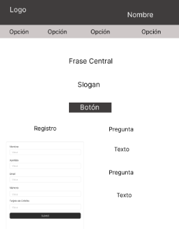
### 4.1.3. Mobile Style Guidelines

- Colores: Menta pastel + Azul marino oscuro.
- Logo: Avión, luna y palmeras.
- Textos:
  - Título: *OASIS PERÚ*
  - Eslogan: "TU DESTINO TE ESTÁ ESPERANDO"
  - Subtexto: "DESCUBRE LUGARES SORPRENDENTE"
- Botón: **"INGRESA AQUÍ"**

## 4.2. Information Architecture

### 4.2.1. Organization Systems

- **Usuarios**:  
  - Jerarquía para navegación: Inicio > Destinos > Experiencias > Eventos.
  - Lineal para reservas: Ubicación → Servicios → Pago.

- **Anfitriones**:  
  - Jerarquía para publicar hospedajes, editar, ver reservas y estadísticas.

### 4.2.2. Labeling Systems

- Barra de navegación:  
  “Explora”, “Reserva”, “Conecta”, “Relájate”, “Disfruta”.

- Etiquetas por tipo de experiencia:  
  _"Romántico"_, _"Aventura"_, _"Relax"_, _"Familiar"_.

### 4.2.3. SEO Tags and Meta Tags

```html
<title>Glamping Perú - Vive la naturaleza con estilo</title>
<meta charset="utf-8">
<meta name="description" content="Plataforma de reservas de glamping en el Perú. Escapadas únicas, accesibles y personalizadas para reconectar con la naturaleza sin perder el confort.">
<meta name="author" content="Equipo Glamping Perú">
<meta name="copyright" content="© 2025 Glamping Perú">
```

### 4.2.4. Searching Systems

El sistema de búsqueda de la plataforma Oasis está diseñado para facilitar la personalización y rapidez en la selección de experiencias de glamping. Se implementa un motor de búsqueda con filtros dinámicos que permite a los usuarios encontrar destinos según sus preferencias específicas.
Características:
Búsqueda por filtros: ubicación, tipo de alojamiento (domo, yurta, cabaña), rango de precios, tipo de experiencia (romántica, familiar, aventura), y servicios disponibles (wifi, desayuno, jacuzzi, etc.).
Búsqueda predictiva/autocompletado: al escribir el nombre de una región o destino, se sugieren opciones populares.
Historial de búsqueda y recomendaciones: el sistema muestra búsquedas recientes y destinos recomendados según las elecciones anteriores del usuario.

### 4.2.5. Navigation Systems

El sistema de navegación está diseñado para ofrecer una experiencia fluida, intuitiva y accesible tanto en dispositivos móviles como en escritorio. Se basa en un enfoque jerárquico con elementos lineales para el proceso de reserva.
Características:<br>
- Menú de navegación superior fijo: incluye secciones como Inicio, Destinos, Experiencias, Eventos y Mi Cuenta.<br>
- Navegación por etapas (lineal) para reservas: el usuario sigue un flujo paso a paso: elegir destino → seleccionar alojamiento → configurar servicios → confirmar reserva.<br>
- Accesos directos visuales: uso de tarjetas clicables con imágenes destacadas que conducen a destinos o categorías populares.

---

## 4.3. Landing Page UI Design

### 4.3.1. Landing Page Wireframe

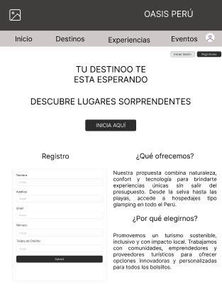
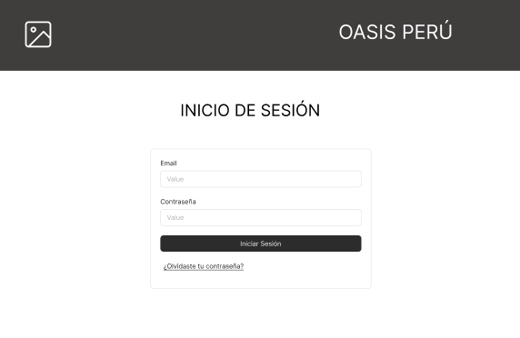
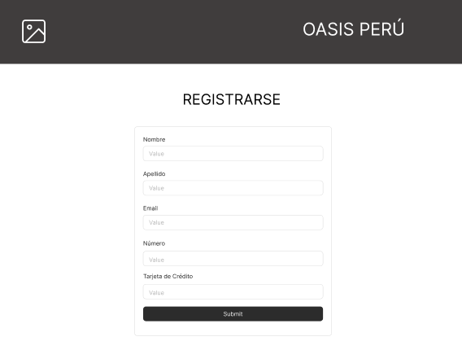
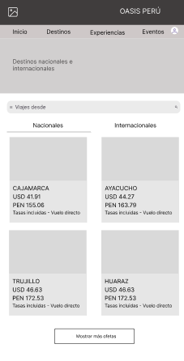
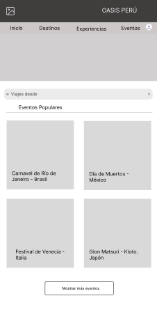
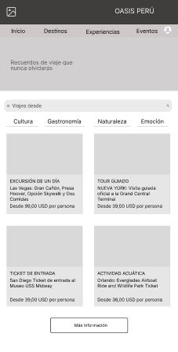

### 4.3.2. Landing Page Mock-up

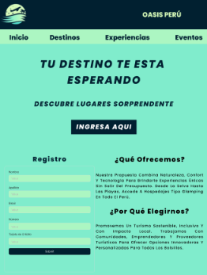
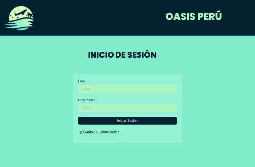
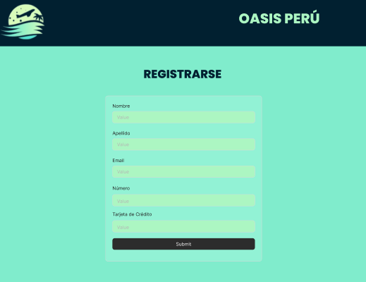
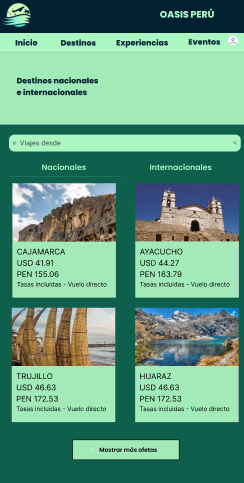
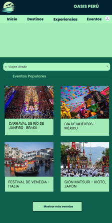
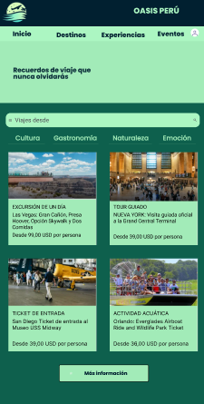

---

### 4.6 Domain-Driven Software Architecture

La arquitectura de software orientada al dominio proporciona una imagen de lo que se quiere en la estructura de software de nuestro producto.
Tal imagen refleja lo que nosotros, Finzar, planteamos para SmartFinance: identificar las funcionalidades de la solución y cómo se van a estructurar adaptándose a los elementos a usar.

### 4.6.1 Software Architecture Context Diagram

Los elementos presentes son:
Visitor (Visitante): Visualiza el landing page.
Customer (Cliente): Accede a la aplicación web.
Administrator (Administrador): Accede a la aplicación web y supervisa su funcionamiento.
Oasis: Software que los usuarios utilizarán.

### 4.6.2  Software Architecture Container Diagrams

Los elementos presentes son:

Landing Page: Página que presenta el producto.
Web App: Frontend donde los usuarios interactúan con la aplicación.
API: Conexión entre el frontend y backend.
Bounded Contexts: Las funcionalidades que el sistema proporciona a los usuarios.
README.md 2024-11-22
71 / 186
Bases de datos: Almacenará datos como cuentas, billeteras, presupuestos, transacciones, entre otros. 

### 4.6.3. Software Architecture Components Diagrams
Bounded Context Account Management
Los elementos presentes son:
Controller: Controla un conjunto de funcionalidades.
Service: Partes de la aplicación que realizan una o varias tareas específicas.
Repository: Permite el acceso a una base de datos. 


**Bounded Context User Wallets**
Los elementos presentes son:
Controller: Controla un conjunto de funcionalidades.
Services: Partes de la aplicación que realizan una o varias tareas específicas.
Repository: Permite el acceso a una base de datos. 


**Bounded Context Transactions and Flows**
Los elementos presentes son:
Controllers: Controla un conjunto de funcionalidades.
Services: Partes de la aplicación que realizan una o varias tareas específicas.
Repositories: Permite el acceso a una base de datos. 


**Bounded Context Wallet Savings**
Los elementos presentes son:
Controller: Controla un conjunto de funcionalidades.
Service: Partes de la aplicación que realizan una o varias tareas específicas.
Repository: Permite el acceso a una base de datos. 


**Bounded Context Wallets & Savings Graphics Providing**
Los elementos presentes son:
Controller: Controla un conjunto de funcionalidades.
Service: Partes de la aplicación que realizan una o varias tareas específicas.
Repository: Permite el acceso a una base de datos.
Context Facade: Proporciona una interface en la cual se puede acceder a los servicios del bounded context. 

---

## 4.7. Software Object-Oriented Design
El diseño orientado a objetos del software será esencial para nuestro proyecto. Estructuramos nuestro software de acuerdo a nuestras reglas de
negocio para poder crear componentes que puedan ser entendibles para su desarrollo en un sistema real, y sean fáciles de modificar para
nosotros.

### 4.7.2 Class dictionary

## Class Dictionary - Proyecto Oasis

### OAS_Usuarios
| Atributo         | Descripción                         |
|------------------|-------------------------------------|
| usu_id           | ID único del usuario                |
| usu_nombre       | Nombre del usuario                  |
| usu_apellido     | Apellido del usuario                |
| usu_email        | Correo electrónico único            |
| usu_contrasena   | Contraseña cifrada del usuario       |
| usu_rol          | Rol del usuario (turista, anfitrión, administrador) |
| usu_fecha_registro | Fecha de registro en la plataforma |

### OAS_Lugares
| Atributo            | Descripción                        |
|---------------------|------------------------------------|
| lug_id              | ID único del lugar                 |
| lug_nombre          | Nombre del lugar                   |
| lug_descripcion     | Descripción detallada              |
| lug_ubicacion       | Dirección o referencia geográfica  |
| lug_tipo            | Tipo de glamping (domo, yurta, cabaña, etc.) |
| lug_precio_por_noche| Precio por noche                   |
| lug_capacidad       | Capacidad de personas              |
| lug_disponible      | Estado de disponibilidad           |
| lug_usuario_id      | ID del usuario que publicó el lugar |
| lug_fecha_publicacion | Fecha de publicación             |

### OAS_Accesibilidad
| Atributo         | Descripción                         |
|------------------|-------------------------------------|
| acc_id           | ID único del servicio de accesibilidad |
| acc_nombre       | Nombre del servicio (ej: rampa de acceso) |
| acc_descripcion  | Descripción del servicio            |

### OAS_Lugar_Accesibilidad
| Atributo         | Descripción                         |
|------------------|-------------------------------------|
| lug_id           | ID del lugar asociado               |
| acc_id           | ID del servicio de accesibilidad asociado |

### OAS_Reservas
| Atributo         | Descripción                         |
|------------------|-------------------------------------|
| res_id           | ID único de la reserva              |
| usu_id           | ID del usuario que realizó la reserva |
| lug_id           | ID del lugar reservado              |
| res_fecha_inicio | Fecha de inicio de la reserva       |
| res_fecha_fin    | Fecha de fin de la reserva          |
| res_costo_total  | Costo total de la reserva           |
| res_estado       | Estado actual de la reserva (pendiente, confirmada, cancelada, completada) |

### OAS_Experiencias
| Atributo         | Descripción                         |
|------------------|-------------------------------------|
| exp_id           | ID único de la experiencia          |
| usu_id           | ID del usuario que deja la reseña   |
| lug_id           | ID del lugar reseñado               |
| exp_comentario   | Comentario del usuario              |
| exp_puntaje      | Puntaje otorgado (1 a 5)            |
| exp_fecha        | Fecha de la reseña                  |

## 4.8 Database Desing
Se creó un diseño preeliminar de la base de datos a utilizar

### 4.8.1 Database Diagram


---

## Capítulo V: Product Implementation, Validation & Deployment
### 5.1. Software Configuration Management.
#### 5.1.1. Software Development Environment Configuration.
En esta sección, detallaremos las herramientas y plataformas que hemos utilizado como equipo para la realización de nuestro startup. Estas herramientas son esenciales para el desarrollo, la colaboración y la gestión del proyecto. A continuación, se presenta un resumen de cada una de las herramientas utilizadas:

- **GitHub**

    **Descripción:** GitHub es una plataforma de alojamiento de código fuente y colaboración basada en Git. Nos permite gestionar el código del proyecto, realizar revisiones de código, y colaborar de manera eficiente con nuestro equipo.<br>
    **Uso:** Se utilizó para el versionado del código, gestión de ramas y pull requests, así como para la documentación del proyecto.

- **Git**

    **Descripción:** Git es un sistema de control de versiones distribuido que facilita la gestión de cambios en el código fuente.<br> **Uso:** Se empleó para realizar commits, push y pull de cambios, así como para la gestión de ramas, permitiendo una colaboración fluida y eficiente en el desarrollo del proyecto.

- **Canva**

    **Descripción:** Canva es una herramienta de diseño gráfico en línea que permite crear gráficos y elementos visuales de manera intuitiva.<br> **Uso:** Se utilizó para diseñar gráficos y elementos visuales para la landing page del proyecto, incluyendo banners, íconos y otros elementos de diseño que mejoran la presentación visual de la aplicación.

- **Visual Studio Code**

    **Descripción:** Visual Studio Code (VS Code) es un editor de código fuente ligero y extensible que soporta una amplia variedad de lenguajes de programación.<br> **Uso:** Se utilizó como el principal editor de código para escribir y editar el código del proyecto, aprovechando sus extensiones para mejorar la productividad y facilitar el desarrollo.

- **Google Meet**

    **Descripción:** Google Meet es una herramienta de videoconferencia que permite realizar reuniones virtuales con facilidad.<br> **Uso:** Se utilizó para llevar a cabo reuniones virtuales de equipo, facilitando discusiones en tiempo real y presentaciones de avances del proyecto a los stakeholders y al equipo.

- **Figma**

    **Descripción:** Figma es una herramienta de diseño colaborativo en línea que permite crear y prototipar interfaces de usuario.<br> **Uso:** Se empleó para el diseño de interfaces y prototipos del proyecto, permitiendo la colaboración en tiempo real entre diseñadores y desarrolladores para ajustar y revisar el diseño de la aplicación.

#### 5.1.2. Source Code Management.

**Gestión del Código Fuente:**

En esta sección, se detalla cómo manejamos y supervisamos el desarrollo del código para el proyecto. Utilizamos GitHub como nuestra plataforma principal para la gestión del código fuente, complementada por Git como sistema de control de versiones. Además, seguimos el flujo de trabajo GitFlow para estructurar el desarrollo de manera eficiente.

- Repositorio GitHub para nuestra Landing Page:(pendiente)

**Ramas Principales:**
- **main:** Esta rama, a menudo llamada "master", contiene la versión más estable y final del proyecto, lista para ser desplegada en producción. Los cambios integrados en esta rama han pasado todas las pruebas y revisiones necesarias, y se consideran completamente preparados para su lanzamiento.

- **develop:** La rama develop es el punto central de integración para las nuevas funcionalidades y mejoras en desarrollo. Las características y correcciones se fusionan en esta rama, donde se realizan pruebas adicionales antes de su eventual integración en la rama main.

**Ramas Auxiliares:**

- **releases:** Las ramas de tipo releases se crean para preparar nuevas versiones del proyecto. En estas ramas se llevan a cabo las pruebas finales y se corrigen errores menores antes del lanzamiento oficial. Una vez que una versión ha sido validada, los cambios se integran en la rama develop para futuros desarrollos y luego se fusionan en la rama main para su despliegue.

**Uso de GitFlow:**

- **Feature Branches:** Se utilizan ramas de características para desarrollar nuevas funcionalidades. Estas ramas se crean a partir de la rama develop y, una vez que se completa el desarrollo y se aprueban las revisiones, se fusionan nuevamente en la rama develop.

- **Bugfix Branches:** Para solucionar errores que necesitan ser corregidos antes de la siguiente versión, se utilizan ramas de corrección de errores. Estas ramas se crean a partir de la rama develop o, en casos críticos, desde la rama main.

- **Hotfix Branches:** Se emplean para abordar errores críticos que requieren una solución urgente en producción. Estas ramas se crean a partir de la rama main, y una vez que el problema se resuelve, los cambios se fusionan tanto en la rama main como en la rama develop.

**Commits Conventions:**

Los commits se nombran de acuerdo con el avance y el contenido específico del trabajo realizado. No seguimos una convención rígida para los nombres de los commits; en su lugar, los desarrolladores utilizan descripciones claras y concisas para reflejar las modificaciones implementadas. Esto nos permite una mayor flexibilidad a la hora de registrar el progreso, asegurando que cada commit tenga un nombre que represente con precisión el trabajo efectuado.

#### 5.1.3. Source Code Style Guide & Conventions.
Hemos implementado varias convenciones de estilo para asegurar un desarrollo de código claro y consistente en distintos lenguajes y tecnologías:

1. El tipo de documento se declara al inicio del archivo con `<!DOCTYPE html>`.

2. Se añaden los meta tags necesarios.

3. La etiqueta `<title>` se incluye dentro del bloque `<head>`.

4. Usamos una indentación de dos espacios.

5. Se escriben en minúsculas los nombres de los elementos HTML, atributos, propiedades, valores y selectores CSS.

6. Los atributos de los elementos HTML siempre están entre comillas.

7. Cada elemento HTML debe contar con su etiqueta de cierre.

8. Se evita escribir líneas de código demasiado largas.

9. Para las imágenes, se especifican tanto el ancho y alto como el texto alternativo.

<b>JavaScript</b>

1. Cada línea de código termina con un punto y coma.

2. Las variables y funciones siguen la convención de CamelCase.

3. Las cadenas de texto (strings) se colocan entre comillas simples.

4. La indentación es de 2 espacios.

5. Se utiliza preferentemente let y const en lugar de var para declarar variables.

6. Gherkin (Convenciones de Gherkin para Especificaciones Legibles)

7. Se utilizan los términos "Given", "When", "Then" y "And" para definir los pasos del escenario.

8. Los pasos que comienzan con "And" se indentan.

9. Se deja una línea en blanco entre los pasos.

10. Los parámetros se colocan entre comillas simples.

11. Se separan los escenarios con un comentario y dos líneas en blanco.

Estas convenciones nos ayudan a mantener el código organizado, legible y coherente a lo largo del proyecto.

#### 5.1.4. Software Deployment Configuration.

Explicaremos cómo realizar el despliegue de nuestra Landing Page utilizando el servicio automatizado en la nube de GitHub Pages. A continuación, detallaremos los pasos necesarios para lograr este proceso.

---

### 5.2. Landing Page, Services & Applications Implementation.
#### 5.2.1. Sprint 1.
#### 5.2.1.1. Sprint Planning 1.

| Sprint #              | Sprint 1 |
|-----------------------|----------|
| **Sprint Planning Background** |          |
| **Date**              | 23/04/2025 |
| **Time**              | 19:00 horas (GMT-5) |
| **Location**          | Virtual (Google Meet) |
| **Prepared By**       | Juan Miguel Quijano Calderon |
| **Attendees (to planning meeting)** | Daniel Elias Ruiz Huisa, Carlos Humberto Zarate Peña, Jhon Rony Huamani Aguilar, Poly Gabriel Alcantara Baldeon    |
| **Sprint 1 Review Summary** | Durante el Sprint 1 se implementó la versión inicial de la landing page. Se completó el diseño básico. Se hizo una demo funcional. El formulario inicial de registro quedó pendiente para el próximo sprint. |
| **Sprint 1 Retrospective Summary** | El equipo no logro una colaboración adecuada y no se estimó adecuadamente los tiempos para una entrega adecuada. Se destacó la fluidez en la integración y el despliegue. Se acordó validar los diseños al inicio del sprint y mejorar la estimación de tareas de animación así como agregar los elementos faltantes. |
| **Sprint Goal & User Stories** |          |
| **Sprint 1 Goal**     | Completar las principales secciones de la Landing Page de la aplicación , permitiendo a los usuarios explorar y familiarizarse con la plataforma. |
| **Sprint 1 Velocity** | **26**  
| **Sum of Story Points** | 26 |

#### 5.2.1.2. Aspect Leaders and Collaborators.

| Team Member (Last Name, First Name) | GitHub Username   | Navigation Bar Leader (L) / Collaborator (C) | Benefits Section Leader (L) / Collaborator (C) | About Us Section Leader (L) / Collaborator (C) | Social Media & Footer Leader (L) / Collaborator (C) | Contact Section Leader (L) / Collaborator (C) |
|-------------------------------------|-------------------|----------------------------------------------|------------------------------------------------|-------------------------------------------------|------------------------------------------------------|-----------------------------------------------|
| Daniel Elias Ruiz Huisa         | DanRuizPeru       | L                     | C                     | C                     | L                     | C                     |
| Carlos Humberto Zarate Peña     | U202315966        | C                     | L                     | C                     | C                     | L                     |
| Jhon Rony Huamani Aguilar       | JhonHuam          | C                     | C                     | L                     | C                     | C                     |
| Juan Miguel Quijano Calderon    | JuanqQuijano      | C                     | C                     | C                     | L                     | C                     |
| Poly Gabriel Alcantara Baldeon  | GabrielAlba24     | C                     | L                     | C                     | C                     | L                     |


#### 5.2.1.3. Sprint Backlog 1

| **Sprint #** | **Sprint 1** |
|--------------|--------------|

| **User Story** | **Work-Item / Task** |
|--------------|--------------|

| **Id**        | **Title**                                | **Id**  | **Title**                     | **Description**                                                    | **Estimation (Hours)** | **Assigned To**                    | **Status** |
|--------------|------------------------------------------|---------|-------------------------------|--------------------------------------------------------------------|------------------------|-----------------------------------|------------|
 | US01 | Barra de navegación en la Landing Page | TS01 |Barra de navegación en la Landing Page (Desarrollado en HTML, CSS y JS).| Implementación del header y la barra de navegación, desarrollados en HTML, CSS y JS con diseño responsive. | 8      |  | Done     |
 | US01 | 	Sección de beneficios de la Aplicación   | TS02 | Sección de beneficios (Desarrollado en HTML, CSS y JS).|Desarrollar una sección que destaque los beneficios clave de RideFind utilizando HTML, CSS, y componentes reutilizables con diseño responsive. | 6                |  | Done                                   |
 | US01 | Información sobre Nosotros           | TS03 | Sección de "Acerca de" (Desarrollado en HTML, CSS y JS).| Implementar la sección "Sobre Nosotros", mostrando información clave de la empresa con diseño responsive  | 4                 |    | Done                                   |
 | US01 | Redes Sociales y Footer | TS04 | Redes Sociales y Footer (Desarrollado en HTML, CSS y JS).| Crear un footer con enlaces a redes sociales, optimizado para diferentes resoluciones de pantalla, asegurando su visibilidad en todo tipo de dispositivos.| 4 |  | Done
 | US01 | Sección de contacto | TS04 | Sección de contacto (Desarrollado en HTML, CSS y JS).| Implementar una sección de contacto con un formulario básico, validación de datos, y diseño responsive para garantizar su correcto funcionamiento en móviles.| 4 |  | Done

 #### 5.2.1.4. Development Evidence for Sprint Review.
 
 | Repository | Branch | Commit Id | Commit <br>Message | Commit <br>Message Body | Commited <br>on (Date) |
|:-------------:|:---------------:|:-------------:|:-------------:|:---------------:|:-------------:|
| landing-page  | main | b67c724d45f0d781e6bb1641469472039df4fbd8 | Implementacion de la seccion principal | - | 26/04/2025 |
| landing-page | main | a7b94cb034e8702cf93a94907a499156513275c2 | Implementacion de la seccion destinos | -- | 26/04/2025 |
| landing-page | main | de33ade90354d7ca9156ec92f80d2747d1335edc | Implementacion de los estilos | -- | 26/04/2025 |
| landing-page | main | de33ade90354d7ca9156ec92f80d2747d1335edc | Implementacion de las animaciones | -- | 26/04/2025 |
| landing-page | main | 8e4d4fd | Implementacion de las animaciones | -- | 26/04/2025 |
 
**Commits realizados al Landing Page**


 #### 5.2.1.5. Execution Evidence for Sprint Review.

Resumen de lo alcanzado en el Sprint 1
   - Completado el header con barra de navegación responsive (TS01).  
   - Desarrollado el footer con enlaces a redes sociales (TS04).
   - Creada la sección de beneficios de la aplicación con componentes reutilizables (TS02).  
   - Implementada la sección “Acerca de Nosotros” (TS03).
   - Utilización de HTML, CSS y JavaScript, estableciendo la base para futuras mejoras.
   - Las 5 tareas planificadas se completaron dentro del Sprint.  
   - El equipo colaboró eficazmente, respetando roles de líderes y colaboradores.
 
 El Equipo ha logrado desplegar la Landing Page Con exito

 - Link de la Landing page: https://desarrollo-open-source-grupo-4.github.io/Landing_Oasis/
 
  
    

 #### 5.2.1.6. Services Documentation Evidence for Sprint Review.
 ## User Stories relacionadas a Servicios

| Story ID | Título | Criterios de Aceptación |
|:--------:|:------:|:------------------------|
| US08 | Registro Anfitriones | **Escenario 1:**<br>**Given** que soy una emprendedora rural sin conocimientos técnicos,<br>**When** ingreso a la sección "Convertirse en anfitrión",<br>**Then** puedo completar un formulario simple con ayuda visual y tutoriales.<br><br>**Escenario 2:**<br>**Given** que quiero registrar mi terreno,<br>**When** solicito soporte técnico,<br>**Then** recibo asistencia remota paso a paso para completar el proceso de registro. |
| US10 | Notificaciones a Anfitriones | **Escenario 1:**<br>**Given** que soy un anfitrión recién registrado,<br>**When** recibo una reserva,<br>**Then** me llega una notificación clara al correo y/o aplicación móvil.<br><br>**Escenario 2:**<br>**Given** que tengo una próxima visita,<br>**When** falta menos de 24 horas,<br>**Then** recibo un recordatorio con los datos del viajero y recomendaciones para la recepción. |
| US12 | Acceso a Comentarios | **Escenario 1:**<br>**Given** que soy un anfitrión con reservas anteriores,<br>**When** accedo a la sección de retroalimentación,<br>**Then** puedo ver todos los comentarios recibidos, su fecha y el nombre del huésped.<br><br>**Escenario 2:**<br>**Given** que soy anfitrión y recibí una nueva reseña,<br>**When** ingreso a la reseña específica,<br>**Then** puedo escribir una respuesta visible públicamente para el huésped y otros usuarios. |
| US13 | Comunidad de Anfitriones | **Escenario 1:**<br>**Given** que soy anfitrión registrado en la plataforma,<br>**When** accedo a la sección de comunidad,<br>**Then** puedo ver publicaciones de otros anfitriones, comentar y compartir consejos.<br><br>**Escenario 2:**<br>**Given** que quiero aprender de otros,<br>**When** sigo a anfitriones destacados,<br>**Then** sus publicaciones aparecen prioritariamente en mi feed. |


 #### 5.2.1.7. Software Deployment Evidence for Sprint Review.
 **Design**
Para realizar el diseño de los wireframes y mockups de la Landing Page para este Sprint, se hizo uso de la plataforma Figma.

**Deployment**
Para la landing page, se utilizará GitHub y Github Pages para la creación del repositorio y el despliegue de la página.
Como ya poseemos una cuenta, utilizamos creamos un repositorio dentro de nuestra organizacion que almaceneara nuestra Landing Page pronto a deployarse.

Para nuestro proyecto se crearon 4 repositorios los cuales son:
**Report**: Este repositorio se usa para realizar el informe del proyecto de manera continua.
**Landing-Page**: Este repositorio se usa para codificar y desplegar la landingpage del proyecto.


 #### 5.2.1.8. Team Collaboration Insights during Sprint.
 
 Para este sprint, las tareas de diseño, implementación y documentación de la landing page se distribuyó entre los integrantes del equipo. La
implementación y despliegue de la landing page fue llevado a cabo principalmente por Juan Quijano.

 #### 5.2.2 Sprint 2
 En esta sección se registra el avance del producto y las acciones colaborativas realizadas por el equipo para el Sprint 2
 
 #### 5.2.2.1. Sprint Planning 2.
   En esta sección se resumen los puntos del Sprint Planning, incluyendo los objetivos, entregables y tareas asignadas para el sprint.
 
 | Sprint #              | Sprint 2 |
|-----------------------|----------|
| **Sprint Planning Background** |          |
| **Date**              | 15/05/2025 |
| **Time**              | 20:00 horas (GMT-5) |
| **Location**          | Virtual (Google Meet) |
| **Prepared By**       | Jhon Rony Huamani Aguilar |
| **Attendees (to planning meeting)** | Daniel Elias Ruiz Huisa, Carlos Humberto Zarate Peña, Jhon Rony Huamani Aguilar, Poly Gabriel Alcantara Baldeon    |
| **Sprint 2 - 1 Review Summary** | Se ha actualizado algunos elementos con respecto al reporte en base al feedback brindado por el docente, además de crear una primera versión Front End de nuestra aplicación web, el cual se seguirá desarrollando en futuras entregas. |
| **Sprint 2 - 1 Retrospective Summary** | Hubo un progreso relativamente bueno con el sprint 2; no se llegaron a completar todas las tareas en su totalidad como se tenía esperado. El equipo reconoce la falta de comunicación y se tomaran acciones con anticipación en las próximas entregas. |
| **Sprint Goal & User Stories** | Permitir a los usuarios visualizar alojamientos de glamping según sus preferencias básicas (ubicación, precio, tipo de alojamiento), con una interfaz funcional de búsqueda y vista previa de resultados.  |
| **Sprint 2  Goal**     | La prioridad en este sprint es la mejora del informe y la implementación de la primera versión de la aplicación front-end. Esto con la finalidad de mostrar las funcionalidades básicas y el diseño de la aplicación web a nuestros primeros usuarios. Podremos identificar puntos de mejora tras la interacción de los usuarios con esta primera versión de la aplicación web.  |
| **Sprint 2 Velocity** | Nuestro equipo puede trabajar hasta 18 story points |  
| **Sum of Story Points** | La suma de story points atendidos es de " " |
 
 #### 5.2.2.2. Aspect Leaders and Collaborators.
 Durante el Sprint 2, el equipo se enfocó en la implementación de una primera versión funcional del front-end de la plataforma web de glamping Oasis. Con el objetivo de organizar y distribuir eficientemente el trabajo, se identificaron los principales aspectos o componentes abordados en el sprint, asignando a cada uno un líder responsable de su desarrollo y colaboradores de apoyo. Esta asignación permite asegurar tanto la calidad del entregable como la colaboración efectiva entre los integrantes del equipo.
 
| Team Member (Last Name, First Name) | GitHub Username | US03 – Buscar alojamientos glamping (L/C) | US05 – Publicar alojamiento (L/C) | US06 – Visualizar catálogo de servicios (L/C) |
| ----------------------------------- | --------------- | ----------------------------------------- | --------------------------------- | --------------------------------------------- |
| Daniel Elias Ruiz Huisa             | DanRuizPeru     | **L**                                     | C                                 | C                                             |
| Carlos Humberto Zarate Peña         | U202315966      | C                                         | **L**                             | C                                             |
| Jhon Rony Huamani Aguilar           | JhonHuam        | C                                         | C                                 | **L**                                         |
| Poly Gabriel Alcantara Baldeon      | GabrielAlba24   | C                                         | C                                 | C                                             |

 
 #### 5.2.2.3. Sprint Backlog 2.

 Esta sección presenta un resumen estructurado del Sprint 2, cuyo objetivo principal fue avanzar en la construcción de una versión inicial funcional del Front-End de la aplicación web, centrada en permitir a los usuarios visualizar alojamientos de glamping según filtros básicos como ubicación, precio y tipo de experiencia.
Se detallan a continuación las metas propuestas para este sprint, las funcionalidades clave a implementar y la distribución de tareas asignadas al equipo. Además, se incluye un screenshot del tablero Trello utilizado como herramienta de gestión y control del trabajo, junto con el enlace público para su consulta.
Este es el link de invitacion a nuestro trello: https://trello.com/invite/b/6826efd999f9b10cfcad7a8c/ATTI9372e13170f62c39e7c4d6e33d215b5aBF230016/1asi0729-2510-4328-grupo-4 


| **Sprint #** | **Sprint 2** |
|--------------|--------------|

| **User Story** | **Work-Item / Task** |
|--------------|--------------|

| **Id**        | **Title**                                | **Id**  | **Title**                     | **Description**                                                   | **Estimation (Hours)** | **Status** |
|--------------|------------------------------------------|---------|-------------------------------|--------------------------------------------------------------------|------------------------|------------|
 | US03 | Buscar alojamientos glamping | TS01 | Diseñar la interfaz de búsqueda (UI)| Maquetar el campo de búsqueda, filtros (ubicación, precio, fechas).| 2 |   Done
 | US03 | Buscar alojamientos glamping | TS02 | Implementar filtros de búsqueda básicos| Crear campos interactivos para seleccionar ubicación y rango de precios.| 1   | Done
 | US03 | Buscar alojamientos glamping | TS03 | Diseñar tarjetas de resultado | Mostrar imagen, nombre, precio por noche, puntuación.| 0.5   | Done
 | US03 | Buscar alojamientos glamping | TS04 | Conectar el buscador con datos simulados|Utilizar JSON o un backend mock para simular resultados.| 0.5   | Done
 | US03 | Buscar alojamientos glamping | TS05 | Diseñar página de resultados| ista limpia con disposición de tarjetas y filtros laterales o superiores.| 1   | Done
 | US03 | Buscar alojamientos glamping | TS06 | Pruebas de interacción| Verificar funcionamiento de filtros y visualización de datos.| 0.5   | Done
 | US05 | Publicar alojamiento | TS07 | Diseñar formulario de publicación | Campos: título, ubicación, precio, tipo de alojamiento, descripción, fotos.| 1  | Done
 | US05 | Publicar alojamiento | TS08 | Agregar validación de campos | Validar campos obligatorios, tipos de dato (precio numérico, texto, etc).| 0.5   | Done
 | US05 | Publicar alojamiento | TS09 | Diseñar interfaz de carga de imágenes | Simulación de carga, sin almacenamiento real aún| 2   | Done
 | US05 | Publicar alojamiento | TS010 | Botón "Publicar" con feedback visual | Mensaje de éxito al enviar el formulario correctamente.| 0.2  | Done
 | US05 | Publicar alojamiento | TS11 | Simulación de envío de datos| Enviar datos a un JSON local | 0.5  | Done
 | US05 | Publicar alojamiento | TS12 | Página de confirmación o resumen| Mostrar los datos ingresados como si fueran publicados.| 0.5  | Done
 | US06 | Visualizar catálogo de servicios | TS13 | Diseñar sección "Explorar experiencias rurales" | Encabezado, introducción breve y categorías.  | 1  | Done
 | US06 | Visualizar catálogo de servicios | TS14 | Diseñar tarjetas de servicio turístico| Imagen, nombre, tipo, precio, ubicación del servicio. | 0.5  | Done
 | US06 | Visualizar catálogo de servicios | TS16 | Simular carga de datos del catálogo | Usar datos ficticios (mock) para mostrar diferentes servicios. | 0.5  | Done
 | US06 | Visualizar catálogo de servicios | TS17 | Diseñar filtro básico por tipo de servicio |Ejemplo: guiado, alimentación, actividades, hospedaje.  | 0.2  | Done

 #### 5.2.2.4. Development Evidence for Sprint Review.

 
  | Repository | Branch | Commit Id | Commit <br>Message | Commit <br>Message Body | Commited <br>on (Date) |
|:-------------:|:---------------:|:-------------:|:-------------:|:---------------:|:-------------:|
| landing-page | main | b67c724d45f0d781e6bb1641469472039df4fbd8 |   |  No description provided | 16/05/2025 |
| landing-page | main | a7b94cb034e8702cf93a94907a499156513275c2 |   |  No description provided | 16/05/2025 |
| landing-page | main | de33ade90354d7ca9156ec92f80d2747d1335edc |   |  No description provided | 16/05/2025 |
| landing-page | main | de33ade90354d7ca9156ec92f80d2747d1335edc |   |  No description provided | 16/05/2025 |
| landing-page | main | 8e4d4fd                                  |   |  No description provided | 16/05/2025 |
 
 #### 5.2.2.5. Execution Evidence for Sprint Review.
En esta entrega no se realizaron cambios significativos en la landing page. Se ha desarrollado un avance con respecto al Frontend como se muestra a continuacion: 


 #### 5.2.2.6. Services Documentation Evidence for Sprint Review.
 
 Durante el Sprint 2, el equipo trabajó en la estructuración inicial de los servicios clave que sustentan las funcionalidades centrales de la plataforma Oasis, en su versión web. 
  Los servicios abordados en este sprint se enfocaron en:
  - Búsqueda de alojamientos
  - Publicación de alojamientos
  - Visualización de catálogo de servicios turísticos.


Acceso al repositorio: https://github.com/Desarrollo-Open-Source-Grupo-4/Oasis-Site/tree/prod 

 #### 5.2.2.7. Software Deployment Evidence for Sprint Review.

 #### 5.2.2.8. Team Collaboration Insights during Sprint.

 #### Avance de Conclusiones, Bibliografía y Anexos.


